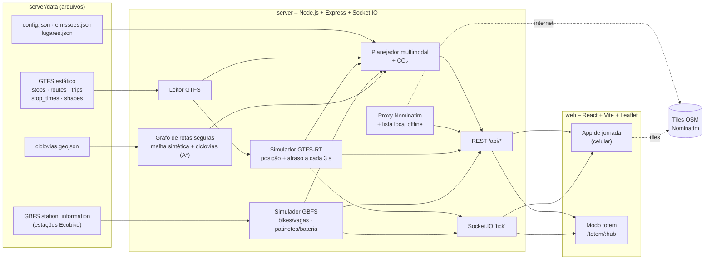

# Indaiatuba Integra

Protótipo funcional da equipe de TI para o **Desafio 1.3 – Uso de Transporte Alternativo, Sustentável e Veículos Autopropelidos – Integração Multimodal "Última Milha"**, em Indaiatuba (SP).

É um app de **jornada integrada (estilo MaaS)** para quem faz os 1 a 3 km entre o terminal de ônibus e o trabalho. Ele junta numa tela só:

- ônibus municipais se movendo **em tempo real**, com a previsão de chegada;
- **estações Ecobike** (bikes e vagas livres) e **patinetes elétricos** compartilhados (com bateria);
- **rotas seguras** para bike e patinete, que priorizam ciclovias e ciclofaixas, coloridas por nível de segurança;
- **alertas** em tempo real e um **simulador de CO₂** evitado;
- um **modo totem** para os hubs (Terminal Central e Terminal Rodoviário).

> ⚠️ **Todos os dados são simulados**, mas usam os formatos padrão de mercado (GTFS, GTFS-Realtime e GBFS). As posições dos terminais vieram do OpenStreetMap e devem ser **conferidas** em `server/data/config.json`. As linhas de ônibus, estações, patinetes e ciclovias são **exemplos**.

---

## Como rodar

Pré-requisito: **Node.js 20 ou superior** (testado com o Node 24).

```bash
npm install
npm run dev
```

- App: <http://localhost:5173>
- Totens: <http://localhost:5173/totem/central> e <http://localhost:5173/totem/rodoviario>
- API: <http://localhost:3001/api/...>

O `npm run dev` usa o `concurrently` para subir o **servidor** (Express + Socket.IO, porta 3001) e o **web** (Vite, porta 5173). O Vite faz proxy de `/api` e `/socket.io` para o servidor.

### No celular (demo)

1. Ligue o computador e o celular na mesma rede Wi-Fi.
2. O Vite mostra o endereço de rede no terminal (`Network: http://192.168.x.x:5173`). Abra esse endereço no celular, ou leia o QR code do totem.
3. O botão **"Usar minha localização"** só funciona em HTTPS no celular, por exigência dos navegadores. Para usá-lo, rode `npm run dev:https`, que gera um certificado autoassinado (aceite o aviso no celular). Sem HTTPS, use a busca ou o atalho **"Demo: Casa → Fábrica"**.

### Variáveis opcionais

| Variável | Para quê | Padrão |
|---|---|---|
| `PORT` | porta da API | `3001` |
| `NOMINATIM_UA` | User-Agent enviado ao Nominatim. **Coloque um contato real da equipe**, pois e-mails de exemplo são bloqueados. | `IndaiatubaIntegra/0.1 (prototipo de hackathon)` |
| `GTFS_DIR` | pasta de um feed GTFS real | `server/data/gtfs` |

Outros comandos: `npm run gerar-gtfs` regenera o GTFS fictício (depois de mudar os terminais no `config.json`), e `npm run typecheck` checa os tipos dos dois pacotes.

---

## Arquitetura



### Estrutura

```
/server
  data/
    config.json            terminais (posição a CONFERIR), velocidades, parâmetros do planejador
    emissoes.json          fatores de CO₂ (valores de referência aproximados)
    lugares.json           lista local para a busca offline
    ciclovias.geojson      malha cicloviária de EXEMPLO
    gtfs/*.txt             GTFS estático fictício (gerado por scripts/gerar-gtfs.ts)
    gbfs/station_information.json
  scripts/gerar-gtfs.ts    gera 4 linhas fictícias que passam pelos dois terminais
  src/
    index.ts               rotas REST, Socket.IO e modo demo
    gtfs.ts                leitor de GTFS
    realtime.ts            simulador GTFS-RT (posições, atrasos, partidas, feeds)
    gbfs.ts                simulador GBFS (Ecobike + patinetes) e feeds
    grafo.ts               grafo de ruas + ciclovias e A* com custo por infraestrutura
    planner.ts             planejador multimodal e cálculo de CO₂
    geocode.ts             proxy do Nominatim com User-Agent + fallback local
    impacto.ts             histórico mockado do mês
/web
  src/
    App.tsx                tela unificada de jornada
    components/            Mapa, CampoBusca, CardOpcao, DetalheViagem, Totem, painéis...
    hooks/                 useAoVivo (Socket.IO), useSimulacao, useAlertas
```

---

## Padrões de dados: GTFS, GTFS-RT e GBFS

| Padrão | O que é | Como usamos |
|---|---|---|
| **GTFS** (General Transit Feed Specification) | Formato aberto, criado pelo Google e hoje mantido pela MobilityData, para o **cronograma** do transporte público: paradas, linhas, viagens, horários e traçados (`shapes`). São arquivos CSV `.txt` num `.zip`. | `server/data/gtfs/` tem `stops.txt`, `routes.txt`, `trips.txt`, `stop_times.txt` e `shapes.txt` (mais `agency.txt` e `calendar.txt`) de **4 linhas fictícias** que passam pelos dois terminais e pelos distritos industriais. |
| **GTFS-Realtime** | Extensão em **tempo real** do GTFS, normalmente em Protocol Buffers: `VehiclePositions` (onde está cada ônibus), `TripUpdates` (atrasos e previsões) e `Alerts`. | O simulador move cada ônibus ao longo do `shape` seguindo o `stop_times` mais um **atraso aleatório pequeno**, e publica tudo a cada 3 s via Socket.IO. Os feeds saem em **JSON com a mesma estrutura de `FeedMessage`** em `/api/gtfs-rt/vehicle-positions` e `/api/gtfs-rt/trip-updates`, e em formato simplificado em `GET /api/vehicles`. |
| **GBFS** (General Bikeshare Feed Specification) | Padrão aberto para **micromobilidade compartilhada**: `station_information` (estações), `station_status` (bikes e vagas agora) e `vehicle_status` / `free_bike_status` (veículos soltos, com GPS e bateria). | `/api/gbfs/gbfs.json` (descoberta), `station_information.json`, `station_status.json` (Ecobike, com bikes e vagas variando), `vehicle_status.json` (patinetes, GBFS v3), `free_bike_status.json` (v2), `vehicle_types.json` e `system_information.json`. |

### Como trocar os dados simulados por feeds reais

O app consome só os formatos padrão. Para ligar dados reais, a troca acontece em um único lugar por feed:

1. **GTFS estático da operadora:** descompacte o `.zip` em `server/data/gtfs/` (ou aponte `GTFS_DIR=/caminho`). O leitor (`gtfs.ts`) já entende o formato padrão e, se o feed não tiver `shape_dist_traveled`, projeta as paradas no traçado. Dá para apagar `scripts/gerar-gtfs.ts`.
2. **GTFS-Realtime da operadora:** em `server/src/realtime.ts`, troque `atualizarVeiculos()` por um *fetch* da URL do feed `VehiclePositions`/`TripUpdates`. Decodifique com o pacote `gtfs-realtime-bindings` e preencha a mesma estrutura `Veiculo` e o mapa de atrasos por `trip_id`. Planejador, alertas, mapa e totem continuam iguais.
3. **GBFS da Ecobike e dos patinetes:** em `server/src/gbfs.ts`, troque `estacoes()` e `listaPatinetes()` por leituras de `station_information` + `station_status` e de `vehicle_status` (ou `free_bike_status`) do operador. O `gbfs.json` de descoberta informa as URLs.
4. **Malha cicloviária:** substitua `server/data/ciclovias.geojson` pelo GeoJSON oficial (`properties.tipo` = `ciclovia` ou `ciclofaixa`). Para roteamento sobre o viário real, troque a malha sintética de `grafo.ts` por um extrato do OpenStreetMap (`highway=*`), mantendo a classificação ciclovia / ciclofaixa / compartilhada / sem infraestrutura.
5. **Posições e fatores:** confira os terminais em `config.json` e ajuste `emissoes.json` com fontes oficiais.

---

## Funcionalidades

### 1. Tela unificada de jornada
- Campos **De** e **Para** com autocomplete. Usa o **Nominatim/OpenStreetMap** por meio do servidor, com debounce de 500 ms, header `User-Agent` e limite de 1 req/s. Sem internet, usa a **lista local** de lugares de Indaiatuba. Tem botão **"Usar minha localização"**.
- Mapa Leaflet (tiles OSM) com **camadas ligáveis**: ônibus ao vivo (ícone com o número da linha e a direção), traçado das linhas, estações Ecobike (bikes | vagas), patinetes (bateria) e ciclovias. As áreas dos terminais aparecem tracejadas (limite de 6 km/h).
- **Planejador multimodal próprio** (sem OpenTripPlanner):
  - combina *caminhada / Ecobike / patinete* → **ônibus** → *caminhada / Ecobike / patinete*, além de "só bike/patinete" para distâncias curtas e "só ônibus + caminhada";
  - estima os tempos com 5 km/h a pé, 15 km/h de bike e patinete (6 km/h de patinete dentro da área do terminal) e o **próximo ônibus real do simulador** (horário + atraso atual);
  - ordena por chegada, com penalidade para trocas e caminhadas longas, e devolve até 3 opções diferentes.
- Cada opção vira um **card**: chips por trecho, horário de saída e chegada, tempo total, "Ônibus 101 chega em X min (ao vivo)", disponibilidade no ponto de troca ("5 bikes na estação Jardim Esplendor"), CO₂ evitado, % em ciclovia e uma barra de segurança.
- Ao tocar um card, a rota aparece no mapa: **ônibus** na cor da linha, **caminhada** pontilhada e **bike/patinete** com contorno do modal e miolo colorido pela segurança do trecho. O ETA continua atualizando ao vivo.

### 2. Rotas seguras e alertas
- O grafo une uma **malha sintética de ruas** (grade de ~180 m; algumas "avenidas" e a zona industrial são vias sem infraestrutura) e as **ciclovias e ciclofaixas** do GeoJSON. O A* usa custo ×0,55 em ciclovia, ×0,7 em ciclofaixa, ×1,0 em rua compartilhada e ×1,8 em via sem infraestrutura.
- Cores dos trechos: 🟩 ciclovia/ciclofaixa, 🟨 rua compartilhada, 🟥 sem infraestrutura. O app mostra "% do trajeto em ciclovia".
- Alertas em tempo real (toasts):
  - "Seu ônibus 101 chega em 3 min";
  - "A estação Ecobike do Terminal Central ficou vazia. Há 3 patinetes a 90 m" (com botão **Replanejar**);
  - "Trecho sem ciclovia adiante, reduza a velocidade";
  - "Área do terminal: limite de 6 km/h para autopropelidos".
- Os alertas de posição usam a **simulação de viagem**: um marcador percorre a rota a 10×, 30× ou 60×. Em produção, a mesma lógica recebe a posição do GPS.

### 3. Simulador de CO₂
- Compara cada opção com o **mesmo trajeto de carro** (linha reta × 1,3), usando os fatores de `emissoes.json`: carro 0,12; ônibus 0,03 por passageiro; patinete 0,005; bike e caminhada 0 (kg CO₂/km). **São valores de referência aproximados**, que devem ser ajustados com fontes oficiais.
- Painel **"Meu impacto"**: total do mês, a partir de um histórico **mockado** mais as viagens concluídas no app, que ficam no `localStorage`. Mostra equivalências como "X árvores trabalhando um mês" e "Y km de carro não rodados", e o comparativo da viagem selecionada.

### 4. Modo Totem
- `/totem/central` e `/totem/rodoviario`: tela cheia em paisagem com próximas partidas ao vivo, bikes e vagas da estação Ecobike do hub (aviso de "estação vazia"), patinetes a até 400 m com bateria, **QR code** que abre o app já com o terminal como origem (`?de=TC`) e a faixa "Área do terminal: limite de 6 km/h". Atualiza sozinho.
- Esse é o ponto de contato com o **redesenho físico** proposto pela equipe de Gestão: o totem fica no hub e o QR leva a jornada para o celular.

### Modo apresentação
O botão **Demo** no topo do app altera o simulador para provocar situações na hora: fazer o ônibus chegar em 3 min, esvaziar uma estação Ecobike, abrir os totens e restaurar tudo. Os alertas disparam a partir dos dados ao vivo, como aconteceria com feeds reais.

---

## Roteiro de demo (3 minutos)

> Antes de começar: `npm run dev`, abra o app no celular (endereço de rede do Vite) e o totem `/totem/central` no notebook ou projetor. Se já tiver feito outro teste, toque em **Demo → Restaurar**.

| Tempo | O que fazer | O que mostrar |
|---|---|---|
| **0:00** | No celular, toque em **"Demo: Casa → Fábrica"**. | Um trabalhador mora no Jardim Esplendor e trabalha no Distrito Industrial Nova Era. Em segundos aparecem 3 opções: **Bike + Ônibus 101 + Patinete**, Patinete + Ônibus 101 + Patinete e Ônibus 101 + caminhada. |
| **0:25** | Mostre o primeiro card. | "Ônibus 101 chega em X min **(ao vivo)**", "5 bikes na estação Jardim Esplendor", "8 vagas para devolver no Terminal Central", **CO₂ evitado** e **% em ciclovia**, com a barra verde/amarela/vermelha. |
| **0:45** | Toque no card e veja o mapa. | A bike segue pela ciclofaixa da Av. Presidente Vargas (verde) até o **Terminal Central**, o ônibus 101 (azul) vai até o distrito e o patinete faz o último km. Os ônibus andam no mapa a cada 3 s. |
| **1:05** | **Demo → "Fazer o ônibus 101 chegar em 3 min"**. | Toast **"Seu ônibus 101 chega em 3 min"**. O card e o ônibus no mapa atualizam ao vivo. |
| **1:20** | Toque em **"Simular viagem"** (30×). | O marcador azul sai de casa, pega a bike e entra na área do terminal: **"Área do terminal: limite de 6 km/h para autopropelidos"**. |
| **1:40** | **Demo → "Esvaziar Ecobike Terminal Central"**. | Toast **"A estação Ecobike do Terminal Central ficou vazia. Há 3 patinetes a 90 m"**. No totem, a estação fica vermelha e aparece "use um patinete". |
| **2:00** | Deixe a simulação seguir (pode passar para 60×). | Ônibus até o distrito; desce, pega o patinete e recebe **"Trecho sem ciclovia adiante, reduza a velocidade"** ao entrar na zona industrial (trecho vermelho). |
| **2:30** | Chegada. Toque em **"Meu impacto"**. | "Você chegou! Evitou ~0,8 kg de CO₂". O painel mostra o acumulado do mês (~6 kg), **árvores-equivalentes** e **km de carro não rodados**. |
| **2:50** | Volte ao **totem**. | Próximas partidas ao vivo, Ecobike, patinetes e o QR code que leva a jornada para o celular. Mensagem final: *trocar a URL do feed pelo da operadora real basta para ligar os dados de verdade*. |

---

## API (resumo)

| Método | Rota | Descrição |
|---|---|---|
| GET | `/api/config` | configuração + fatores de emissão |
| GET | `/api/rede` | paradas, traçados das linhas e terminais (do GTFS) |
| GET | `/api/vehicles` | ônibus ativos (JSON simplificado) |
| GET | `/api/gtfs-rt/vehicle-positions`, `/api/gtfs-rt/trip-updates` | feeds no esquema GTFS-Realtime (JSON) |
| GET | `/api/paradas/:id/partidas` | próximas partidas de uma parada (ao vivo) |
| GET | `/api/gbfs/gbfs.json` e feeds | GBFS simulado |
| GET | `/api/ciclovias` | GeoJSON da malha cicloviária |
| GET | `/api/geocode?q=` | busca (local + Nominatim) |
| POST | `/api/planejar` | `{ de: {lat, lon, nome}, para: {...} }` → opções de jornada |
| GET | `/api/impacto` | histórico mockado do mês |
| POST | `/api/demo/...` | modo apresentação (esvaziar estação, adiantar ônibus, reset) |
| WS | `tick` (Socket.IO) | a cada 3 s: `{ veiculos, estacoes, patinetes }` |

## Limitações conhecidas (é um protótipo)
- Dados de ônibus, Ecobike, patinetes e ciclovias são **fictícios**. O serviço simulado roda 24 h para a demo funcionar a qualquer hora.
- O grafo de ruas é **sintético**, então os trajetos de bike e caminhada são aproximados (sem o viário real).
- O planejador considera **um** ônibus por viagem (sem baldeação entre linhas).
- O estado da simulação fica em memória e reinicia junto com o servidor.
- Os fatores de CO₂ e a equivalência em árvores são **aproximações** para fins de demonstração.
